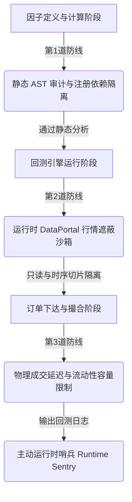

# 工业级量化架构研判：MiniQLib 严格防止数据泄露与事件驱动回测引擎升级方案

**日期**：2026-05-27  
**研究员**：Antigravity  
**项目**：MiniQLib (原生多因子计算与回测平台)  
**文档状态**：已批准 (Execution Phase)  
**文件路径**：`EXP_and_LOG/2026-05-27/strict_leakage_prevention_and_event_driven_backtest_plan.md`

---

## 🛠️ 一、 导言与设计哲学 (Introduction & Philosophy)

在量化交易系统和多因子研究平台中，**回测的高保真度（High-Fidelity Backtesting）**是决定策略能否成功实盘上线的生死线。而高保真度的最大杀手是**数据泄露（Data Leakage）**，也称作**前瞻偏差（Look-Ahead Bias）或未来函数**。

数据泄露通常在不经意间渗透进因子的计算、数据集的切分、或是回测撮合引擎的细节中。哪怕在历史测试中跑出完美的净值曲线（Sharpe Ratio > 5），一旦上实盘，也会因为“无法在真实交易中偷看未来”而发生毁灭性的业绩塌方。

在成功落地了 **第一阶段（反射与参数锁）**、**第二阶段（跨股时序隔离与缓存）** 以及 **第三阶段（Pipeline 与数据集隔离 Embargo）** 之后，MiniQLib 的核心 AST 计算引擎已具备坚实的工业级底座。本方案立足于微软 **`Qlib`** 的高性能交易所设计与 **`Zipline`** 的严格事件驱动（Event-Driven）控制，为 MiniQLib 规划一套**全链路、零漏洞的严格防数据泄露兜底保障系统**与**可扩展的事件驱动回测引擎升级路线图**。

---

## 🔬 二、 标杆框架核心防泄露机制深度剖析 (Benchmark Study)

### 1. Zipline 严格的事件驱动控制 (Zipline's Strict Event-Driven Architecture)
`Zipline-Reloaded` 采用极度严苛的 Bar-by-Bar 事件触发模式，其防泄漏设计的精髓在于**物理隔离数据访问权限**与**强制引入物理撮合时间滞后**：
* **Generator-based 事件驱动轴**：回测引擎的核心由 Python 生成器（Generator）驱动。时间只能单向推进（不可逆），在任意给定的交易时刻 $T$：
  * **DataPortal 数据网关**：策略仅能通过回测引擎传入的 `data` 对象（DataPortal 的外壳代理）查询行情。当策略调用 `data.current(assets, 'close')` 或 `data.history(assets, 'close', 10, '1d')` 时，DataPortal 底层会自动拦截，截断任何时间戳大于 $T$ 的数据切片。策略**在物理上绝对无法读取任何 $t > T$ 的未来价格**。
  * **订单账簿与延迟撮合（Blotter & Matching）**：策略在 $T$ 时刻根据已知数据做出买卖决策并调用 `order()`，订单不会在 $T$ 时刻同步、瞬时成交。它必须被存入 `blotter.open_orders` 待成交队列中。行情驱动引擎向后前推至下一个 Bar（如 $T+1$），撮合模块才会基于 $T+1$ 时刻的真实可成交价（如 $T+1$ 的 Open 价，或带有滑点损耗的价格）对 $T$ 时刻的订单进行撮合成交。

### 2. Qlib 高性能交易所与账户生命周期 (Qlib's High-Performance Exchange & Account System)
微软 `Qlib` 框架在支持批量向量化回测的同时，也引入了逼真的高仿真撮合与账户控制系统：
* **Exchange (交易所) 仿真模块**：
  * Qlib 的 `Exchange` 类完全模拟了现实中的券商与交易所接口。它提供了严格的**订单状态机（Order Lifecycle）**管理，订单经历了从 `Created` -> `Pending` -> `Filled` / `Canceled` / `Rejected` 的规范流转。
  * 强制价格延迟：在回测配置中，通过 `trade_range` 和 `delay` 参数，指定订单决策依据的价格与实际成交的价格之间具有物理间距（例如，使用 $T$ 日收盘因子做出的权重决策，必须在 $T+1$ 日以 $T+1$ 日的成交价格执行），彻底切断了“当期决策，当期以当期收盘价无偏成交”的幻觉。
* **账户状态机 (Account & Position)**：
  * 严格的现金与持仓分离管理。在 $T$ 时刻撮合订单时，必须核减 $T$ 时刻账户的 `available_cash`，确保没有因透支资金或在未实际收到卖出款项前使用未来资金。

---

## 🏗️ 三、 MiniQLib 升级：三重数据泄露拦截网设计 (Three-Layer Defense Guard)

为使 MiniQLib 拥有防范任何隐式与显式数据泄露的兜底措施，我们设计并规划以下**三重纵深防御网**：



---

### 🛡️ 第一道防线：编译期与分析期静态阻断 (Static & Topographic Audit)

在多因子流水线开始之前，通过静态代码分析与公式树依赖拓扑（DAG）审计，直接切断可能引起泄露的公式源头。

#### 1. 时间算子负向偏移硬拦截
在算子底层基类 `Rolling` 与时序算子 `Ref` 中，重构构造器检查逻辑。
* **拦截机制**：在 AST 构建（`__init__` 反射绑定）时，对参数 $N$ 进行安全审计。如果检测到 $N < 0$（例如输入 `Ref($close, -1)`，意为获取未来 1 日的收盘价），或者 `Shift` 参数导致时间轴向前平移，直接抛出 `LookAheadException` 异常，当场熔断，不予编译。
* **例外放行（Label 专用通道）**：考虑到计算训练集的 Label（如未来 5 日超额收益）天然需要未来数据，系统提供一个受保护的显式上下文管理器 `allow_future_data()`。**仅在**计算受信任的 `Label` 时临时允许负数偏置算子存在，特征（Feature）计算链路绝对禁止进入该上下文。

#### 2. 特征-标签（Feature-Label）拓扑隔离器
* **风险点**：在复杂的量化项目中，由于因子公式繁多，研究员可能会无意中在特征中引用了已经注册的 `Label` 公式（例如，特征 A 的子项里嵌套了 `Label_5d`），导致标签信息严重泄露给特征。
* **隔离设计**：
  * 引入 `RegistryDependencyGraph`。每次通过 `feature_registry` 注册特征或通过 `label_registry` 注册标签时，分析器会自动解析其 AST 公式，构建该公式的节点依赖图（DAG）。
  * 在流水线编译 DataHandler 时，对所有输入特征表达式进行依赖着色标记。若检测到任何特征因子的依赖路径中包含已被 `label_registry` 注册的公式节点，直接抛出 `DependencyLeakageException` 并输出明晰的路径追溯（例如：`Feature 'Alpha01' -> Dependency 'Label_5d' detected! Calculation Aborted.`）。

---

### 🛡️ 第二道防线：运行时 DataPortal 行情遮蔽沙箱 (Runtime Sandbox Gatekeeper)

在回测循环开始后，策略代码会被载入到一个定制的“时间隔离沙箱”中运行。

#### 1. 行情只读视图隔离 (Read-Only Matrix Proxy)
策略在回测期间对行情矩阵的读写操作必须受到最严格的限制，以防通过 Hack 内部 DataFrame 篡改价格信息。
* **实现方案**：向策略回调函数（如 `on_bar(context, data)`）传入的 `data` 对象底层所包装的行情 `DataFrame`，一律通过 `pandas.DataFrame.copy(deep=False)` 生成轻量拷贝，并将其 `.flags.writeable` 设为 `False`。任何试图在策略内部执行 `df['close'] = ...` 的写操作都会被 Python 底层直接抛出 `ValueError: buffer is readonly` 拦截。

#### 2. Bar-by-Bar 只读数据门禁 (Temporal Clipping)
* **实现方案**：设计 `DataPortal` 类作为策略查询历史和当前行情数据的唯一入口。
  ```python
  class DataPortal:
      def __init__(self, df: pd.DataFrame):
          self._raw_df = df  # 拥有完整行情的 DataFrame
          
      def get_history(self, ticker: str, field: str, current_date: pd.Timestamp, N: int) -> pd.Series:
          """
          严格隔离获取当前交易日 current_date 及其之前 N 期的历史数据，
          绝对过滤掉任何时刻大于 current_date 的数据行。
          """
          # 物理阻断：截取 <= current_date 的时序数据
          sub_df = self._raw_df.loc[self._raw_df.index.get_level_values('date') <= current_date]
          
          # 根据 ticker 提取单只股票时序
          ticker_series = sub_df.xs(ticker, level='ticker')[field]
          return ticker_series.tail(N)
  ```
* **效果**：回测引擎的时间轴在逐日推进时，策略通过 `DataPortal` **在物理上只能感知到当前及过去的数据**。即使底层大数据库里有未来的数据，策略代码也彻底被蒙在鼓里，绝无在 $T$ 时刻访问 $T+1$ 价格的可能。

---

### 🛡️ 第三道防线：物理成交延迟与流动性容量限制 (Execution & Liquidity Constraints)

在订单撮合阶段，建立反映真实物理世界摩擦力（Friction）的限制，消除因脱离实际成交阻力而产生的信息优势。

#### 1. 严格的订单成交延迟（Order T+1 Latency Matching）
* **规则**：坚决废除“当期决策，当期立即以当期已知收盘价/开盘价成交”的零延时模型。
* **撮合机制设计**：
  * **$T$ 周期（如日度 Bar 结束时）**：策略完成决策，生成包含 `ticker`, `direction` (买/卖), `volume` (股数), `order_type` (市价/限价) 的 `Order` 实例，提交给回测账簿 `Blotter`。此时订单状态为 `PENDING`。
  * **$T+1$ 周期开始**：回测循环时间轴正式推移到 $T+1$。
  * **撮合执行**：撮合器 `Matcher` / `Exchange` 启动，仅能使用 **$T+1$ 周期及以后**的数据来撮合挂起的 `PENDING` 订单。
    * *若为下一日开盘价成交 (Next-Open Matcher)*：以 $T+1$ 日的 `open` 价格撮合，状态变更为 `FILLED`。
    * *若为下一日均价成交 (Next-VWAP Matcher)*：以 $T+1$ 日的成交量加权平均价 `vwap` 撮合，更具实盘保真度。
  * **优势**：消除了“看着收盘价决定按收盘价买入”的严重 look-ahead bias。由于下达决策与成交价格存在物理时差，策略必须承担 overnight 风险与滑点风险，回测结果将高度贴近实盘。

#### 2. 流动性容量限额与部分成交 (Liquidity Cap & Partial Fill)
* **风险点**：很多高频或中频因子回测未考虑市场真实容量。在日成交量只有 10,000 股的小盘股上，回测以当日收盘价虚设瞬间成交 1,000,000 股，产生脱离现实的虚假获利。
* **设计逻辑**：
  * 在 $T+1$ 撮合时，获取该股票 $T+1$ 日的真实成交量 `volume`。
  * 设置流动性约束比例 `max_volume_ratio`（如 10%）。
  * 订单的最大成交量被物理锁定为：
    $$\text{Max Executable Volume} = \text{Volume}_{T+1} \times \text{max\_volume\_ratio}$$
  * 如果订单的 `volume` 大于该最大可成交量，则仅撮合 $\text{Max Executable Volume}$ 部分，剩余股数自动撤单（Cancel）或留存至下一期（Keep Pending），防止因脱离市场实际深度而导致“回测容量泄露”。

#### 3. 滑点与交易成本强制拦截器
* **设计逻辑**：
  * 回测配置中强制启用滑点模型（如 `VolumeShareSlippage` 或固定点差滑点 `FixedSlippage`）和手续费率（如印花税 0.1%，佣金 0.03%）。
  * 所有的成交价格必须叠加滑点惩罚。严禁“无摩擦完美成交”，防止策略利用高换手率在无成本的沙盒中刷出虚假超额。

---

## 📅 四、 Point-in-Time 基本面财务因子“披露日”对齐机制 (PIT Fundamental Data)

在涉及公司财务报表（Balance Sheet, Income Statement, Cash Flow）等多因子研究中，最普遍也最隐蔽的数据泄露在于**直接以会计期末日（Period End）做时间对齐**。
例如：直接将 2025 年第四季度财报（报表截止日 2025-12-31）挂载在 2025-12-31 的交易日历上进行多因子计算。然而，美国上市公司通常要在 2026 年 1 月末甚至 2 月底才正式向 SEC 递交 10-K 报表披露数据。如果策略在 2026 年 1 月初就使用了这笔数据，就是严重偷看了未来数据。

### MiniQLib 的 PIT 双时间戳对齐架构设计：

```text
财报季度截止日 (Period End): 2025-12-31 (数据所属区间)
  └─ 会计数据在物理上已经生成，但对市场完全隐秘 ❌
                                   
真实递交披露日 (Filed Date): 2026-02-15 (数据公开区间)
  └─ 数据向市场全网公布，对策略正式可见 ✅
```

### 实施路线图：
1. **DuckDB 物理表结构改造**：
   财务基本面数据表一律强制包含 `filed_date`（真实披露日）与 `period_end`（会计期末日）双重字段。
2. **时序双时间戳动态索引器 (Point-in-Time Indexer)**：
   在交易日 $T$ 查询任何基本面财务项（如 `$revenue`）时，采用如下检索条件在 DuckDB 中执行 PIT 对齐查询：
   ```sql
   SELECT revenue 
   FROM balance_sheet 
   WHERE ticker = :ticker 
     AND filed_date <= :current_trading_date 
   ORDER BY filed_date DESC, period_end DESC 
   LIMIT 1
   ```
3. **计算图安全验证**：
   通过上述机制，在 2026-01-15 这个交易日进行多因子回测时，由于 `2026-02-15 (filed_date) > 2026-01-15`，策略仅能获取到 2025 年第三季度（甚至更早）的已披露财务信息，2025 年报数据在物理上被完全封锁，彻底杜绝了基本面因子的未来函数隐患。

---

## 🚨 五、 运行时哨兵机制 (Runtime Sentry & Double-Check Guard)

除了在各个阶段的层层防线，系统在回测完毕输出报告前，必须增设一个全局的“终极大检查官”——**运行时主动哨兵（Runtime Sentry）**。

1. **时序因果律断言 (Causality Assertions)**：
   在回测引擎产生的所有成交明细记录（Trade Logs）上，强制执行如下底线性断言：
   ```python
   # 断言成交时间绝对晚于决策下达时间
   assert trade.timestamp >= order.timestamp + min_execution_delay
   
   # 断言成交使用的价格只能是成交时刻及以后发生的价格，严禁在过去的价格成交
   assert trade.price == get_market_price(trade.ticker, trade.timestamp, trade.price_type)
   ```
2. **策略代码行为动态监控器 (Audit Hook)**：
   利用 Python 的 `sys.settrace` 或特制装饰器，监控策略代码的 DataFrame 属性读取行为。如果检测到策略内部直接通过 pandas 对全局的 `market_data_df` 进行切片取索引，且取值范围超出了当前模拟回测的时间指针，哨兵会立即报警并强制终止回测，出具严重警告报告。

---

## 📈 六、 事件驱动回测引擎升级路线图 (Implementation Roadmap)

本部分为 MiniQLib 规划了向高保真事件驱动回测演进的三个清晰步骤。

### 📋 阶段一：搭建回测核心框架与只读 DataPortal 沙箱 (当前规划重点)
* **核心任务**：
  * 在 `mini_qlib/` 下新建 `backtest/` 子包，包含 `backtest.py` (核心事件循环) 和 `data_portal.py` (数据网关沙箱)。
  * 实现基于 Python Generator 的 Bar 递推进度控制，完成 `on_bar` 策略回调接口设计。
  * 编写 `DataPortal` 类，完成多股票行情 `<= current_date` 的严格切片与只读隔离。
* **交付件**：通过 `sometest/test_backtest_sandbox.py` 验证在策略代码里试图获取未来价格时，被 `DataPortal` 完美返回 `KeyError` 或剔除的处理表现。

### 📋 阶段二：实现 Blotter 订单管理与延迟撮合交易所 (Exchange Integration)
* **核心任务**：
  * 新建 `backtest/blotter.py`，管理账户资金、持仓头寸和 `PENDING` 订单状态机。
  * 新建 `backtest/exchange.py`，借鉴 Qlib 的交易所机制与 Zipline 的滑点模型，实现 Next-Open (次日开盘价) 与 Next-VWAP (次日均价) 撮合逻辑。
  * 实现流动性占比上限控制（Max Volume Cap），支持因市场深度不足造成的部分成交与自动撤单机制。
* **交付件**：设计一个简单的“均线突破策略”，验证策略在 $T$ 日生成信号，订单在 $T+1$ 日以真实开盘价成交并扣除手续费的闭环测试。

### 📋 阶段三：集成 DataHandler 多因子流水线与基本面 PIT 对齐
* **核心任务**：
  * 将上一阶段成熟的 `DataHandler` 表达式编译引擎与事件驱动回测全面打通。
  * 在 `on_bar` 循环中，允许策略通过 `DataPortal` 调用 `DataHandler` 动态计算当日的因子特征。
  * 在 DuckDB 层面完整落地双时间戳财务基本面 PIT 索引器，使得回测能够支持“技术面因子 + 基本面因子”的混合事件驱动交易。
* **交付件**：运行完备的 LightGBM 预测模型在测试集上的事件驱动模拟交易，输出高真实度的总资产净值曲线（NAV）、最大回撤（MDD）、Sharpe 比率等专业报表。

---

## 🌐 七、 双语注释契约与 UTF-8 编码防守

为秉承 MiniQLib 的卓越开发契约，本项目规定：
1. **后续代码编写**：所有的回测子模块文件（如 `data_portal.py`, `exchange.py` 等）以及相关的测试文件，其核心函数定义、Docstrings 均**必须严格采用中英双语对照格式编写**。
2. **文件读写安全**：所有读写回测参数配置文件、序列化订单记录、成交明细等操作，均必须显式添加 `encoding="utf-8"` 参数，彻底封锁跨平台的编码崩溃风险。

---

### 📝 结论与下一步行动计划

本方案旨在为 MiniQLib 打造工业级的量化研究高保真度长效防线。通过：
1. **静态 AST 阻断 + 标签拓扑依赖解析** 封锁因子定义泄露；
2. **Bar 只读切片 DataPortal 沙箱** 封锁策略运行行情泄漏；
3. **严格的 $T+1$ 成交延迟与流动性阈值约束** 封锁交易撮合泄露；
4. **真实披露日 PIT 对齐** 封锁基本面因子泄漏。

我们将分三个阶段稳步推进该架构升级。在下一步中，我们将首先启动 **阶段一**：正式在 `mini_qlib/` 下构建 `backtest/` 和 `data_portal.py`，并编写严密的数据泄露阻断集成测试，确保平台底座万无一失。
