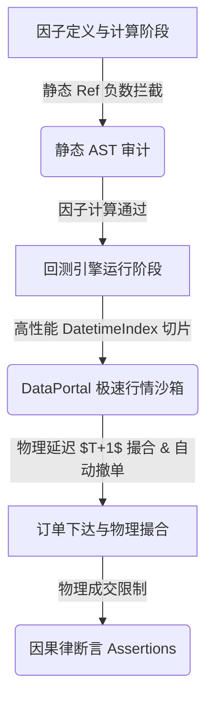

# 工业级量化架构研判：MiniQLib 严格防止数据泄露与事件驱动回测引擎升级方案 (审计修正版)

**日期**：2026-05-27  
**研究员**：Antigravity  
**项目**：MiniQLib (原生多因子计算与回测平台)  
**文档状态**：已批准 (根据审计反馈修正)  
**文件路径**：`EXP_and_LOG/2026-05-27/strict_leakage_prevention_and_event_driven_backtest_plan.md`

---

## 🛠️ 一、 导言与设计哲学 (Introduction & Philosophy)

在量化交易系统和多因子研究平台中，**回测的高保真度（High-Fidelity Backtesting）**是决定策略能否成功实盘上线的生死线。而高保真度的最大杀手是**数据泄露（Data Leakage）**，也称作**前瞻偏差（Look-Ahead Bias）或未来函数**。

在成功落地了 **第一阶段（反射与参数锁）**、**第二阶段（跨股时序隔离与缓存）** 以及 **第三阶段（Pipeline 与数据集隔离 Embargo）** 之后，MiniQLib 的核心 AST 计算引擎已具备坚实的工业级底座。本方案立足于微软 **`Qlib`** 的高性能交易所设计与 **`Zipline`** 的严格事件驱动（Event-Driven）控制，对回测过程中的防数据泄露措施进行精简、实效性的兜底规划，剔除过度设计，保留核心骨架，确立极速、可靠的事件驱动回测引擎升级路线图。

---

## 🔬 二、 标杆框架核心防泄露机制深度剖析 (Benchmark Study)

### 1. Zipline 严格的事件驱动控制 (Zipline's Strict Event-Driven Architecture)
`Zipline-Reloaded` 采用极度严苛的 Bar-by-Bar 事件触发模式，其防泄漏设计的精髓在于**物理隔离数据访问权限**与**强制引入物理撮合时间滞后**：
* **Generator-based 事件驱动轴**：回测引擎的核心由 Python 生成器（Generator）驱动。时间只能单向推进（不可逆），在任意给定的交易时刻 $T$：
  * **DataPortal 数据网关**：策略仅能通过回测引擎传入的 `data` 对象（DataPortal 的外壳代理）查询行情。当策略调用 `data.current(assets, 'close')` 或 `data.history(assets, 'close', 10, '1d')` 时，DataPortal 底层会自动拦截，截断任何时间戳大于 $T$ 的数据切片。策略**在物理上绝对无法读取任何 $t > T$ 的未来价格**。
  * **订单账簿与延迟撮合（Blotter & Matching）**：策略在 $T$ 时刻根据已知数据做出买卖决策并调用 `order()`，订单不会在 $T$ 时刻同步、瞬时成交。它必须被存入 `blotter` 待成交队列中。行情驱动引擎向后前推至下一个 Bar（如 $T+1$），撮合模块才会基于 $T+1$ 时刻的真实可成交价（如 $T+1$ 的 Open 价，或带有滑点损耗的价格）对 $T$ 时刻的订单进行撮合成交。

### 2. Qlib 高性能交易所与账户生命周期 (Qlib's High-Performance Exchange & Account System)
微软 `Qlib` 框架在支持批量向量化回测的同时，也引入了逼真的高仿真撮合与账户控制系统：
* **Exchange (交易所) 仿真模块**：
  * Qlib 的 `Exchange` 类完全模拟了现实中的券商与交易所接口。它提供了严格的**订单状态机（Order Lifecycle）**管理。
  * 强制价格延迟：在回测配置中，通过 `trade_range` 和 `delay` 参数，指定订单决策依据的价格与实际成交的价格之间具有物理间距（例如，使用 $T$ 日收盘因子做出的权重决策，必须在 $T+1$ 日以 $T+1$ 日的成交价格执行），彻底切断了“当期决策，当期以当期收盘价无偏成交”的幻觉。

---

## 🏗️ 三、 MiniQLib 升级：精简版数据泄露双重拦截网设计 (Pruned Anti-Leakage Guard)

结合单人量化项目高效开发的实际需求，我们对防泄漏设计进行了“脱水审计”：**砍掉针对“不存在的威胁”的过度防线（如 DAG 依赖隔离、只读 DataFrame 锁定），重点聚焦于高频调用的时序截断性能优化，以及符合真实物理世界的交易撮合约束**。



---

### 🛡️ 第一道防线：编译期与分析期静态阻断 (Static Ref Check)

在多因子流水线开始之前，通过轻量级静态公式树审计，直接切断可能引起泄露的未来函数源头。

#### 时间算子负向偏移硬拦截
在算子底层基类 `Rolling` 与时序算子 `Ref` 中，重构构造器检查逻辑。
* **拦截机制**：在 AST 构建（`__init__` 反射绑定）时，对参数 $N$ 进行安全审计。如果检测到 $N < 0$（例如输入 `Ref($close, -1)`，意为获取未来 1 日的收盘价），或者 `Shift` 参数导致时间轴向前平移，直接抛出 `LookAheadException` 异常，当场熔断，不予编译。
* **例外放行（Label 专用通道）**：考虑到计算训练集的 Label（如未来 5 日超额收益）天然需要未来数据，系统提供一个受保护的显式上下文管理器 `allow_future_data()`。**仅在**计算受信任的 `Label` 时临时允许负数偏置算子存在，特征（Feature）计算链路绝对禁止进入该上下文。
* *审计结论*：**保留本模块。** 该模块轻量、极具实际价值，能直接在编译阶段抓出研究员编写特征公式时笔误写错的方向。
* *审计结论 (砍掉)*：**完全移除原设计的 `RegistryDependencyGraph` (DAG 拓扑隔离器)**。由于特征列表和标签列表在 `config_pipeline.yaml` 配置文件中天然就是物理分开的两个独立列表，开发中根本不会出现“特征嵌套 Label 公式”这种虚无场景，无需为此多写繁琐的 DAG 追踪开销。

---

### 🛡️ 第二道防线：高性能 DataPortal 行情遮蔽沙箱 (High-Performance Sandbox)

在回测循环开始后，策略代码仅通过一个高性能的“时间隔离门禁”进行数据检索。

#### 1. 砍掉只读 Matrix 锁 (.flags.writeable)
* *审计结论 (砍掉)*：**移除原设计的 `pandas.DataFrame.copy(deep=False)` 并设置只读锁属性的行为。** 本项目为单人开发项目，开发者对自己编写的回测代码有完全控制权，策略代码不会主动恶意篡改行情数据；保留只读锁只是防御一个不存在的自身威胁，无端增加代码复杂性。

#### 2. 高性能 DatetimeIndex 排序切片门禁
* **性能痛点分析**：在原版设计中，`DataPortal.get_history()` 每次被调用时，都对整个 DataFrame 执行 `df.index.get_level_values('date') <= current_date` 的全量布尔扫描。在 500 只股票 × 逐日循环的长周期回测场景下，由于每次循环都会进行 $O(N)$ 的大型 Panel 表全扫描，会导致严重的性能雪崩。
* **优化设计方案**：
  * **DatetimeIndex 预排序与前向切片**：确保行情 DataFrame 在传入 `DataPortal` 时已经按 `['date', 'ticker']` 进行升序排序，且将 `date` 设为第一层 Index。
  * **利用 pandas 极速二分定位（$O(\log N)$）**：借助排好序的 MultiIndex，使用 `df.loc[:current_date]` 或在 DataPortal 初始化时预先提取出各个日期对应的物理索引切片（Slice 字典），在回测循环中直接通过 $O(1)$ 的字典查找或 $O(\log N)$ 的二分切片获取截断视图：
  ```python
  class DataPortal:
      def __init__(self, df: pd.DataFrame):
          # 强制进行索引排序以启动 pandas 内部的极速二分检索
          self._raw_df = df.sort_index(level=['date', 'ticker'])
          
      def get_history(self, ticker: str, field: str, current_date: pd.Timestamp, N: int) -> pd.Series:
          """
          高性能二分检索：严格获取当前交易日 current_date 及其之前 N 期的单股历史数据
          """
          # 利用已排序 DatetimeIndex 的极速切片，避免 O(N) 全表布尔扫描
          time_truncated_df = self._raw_df.loc[:current_date]
          
          # 根据 ticker 提取单只股票时序并获取末尾 N 项
          try:
              # xs 操作在 MultiIndex 排序后非常快速
              ticker_series = time_truncated_df.xs(ticker, level='ticker')[field]
              return ticker_series.tail(N)
          except KeyError:
              return pd.Series(dtype='float64')
  ```
* *审计结论*：**保留 DataPortal.get_history() 门禁，并采用此高性能排序切片优化方案。**

---

### 🛡️ 第三道防线：物理成交延迟与流动性容量限制 (Execution & Liquidity Constraints)

在订单撮合阶段，建立反映真实物理世界摩擦力（Friction）的限制，这是回测最扎实、最核心的部分。

#### 1. 严格的订单成交延迟（Order T+1 Latency Matching）
* **撮合机制设计**：
  * **$T$ 周期（如日度 Bar 结束时）**：策略完成决策，生成包含 `ticker`, `direction` (买/卖), `volume` (股数) 的 `Order` 实例，提交给回测账簿。订单状态为 `PENDING`。
  * **$T+1$ 周期开始**：回测循环时间轴正式推移到 $T+1$。
  * **撮合执行**：撮合器启动，仅能使用 **$T+1$ 周期及以后**的数据来撮合挂起的 `PENDING` 订单。以 $T+1$ 日的 `open` 价格或成交量加权平均价 `vwap` 撮合，状态变更为 `FILLED`。
* **物理隔离优势**：完全封锁 $T$ 日决策以 $T$ 日 Close 成交的“瞬时偷看买入”漏洞，策略必须承担隔夜跳空与真实滑点风险。

#### 2. 流动性限制与部分成交自动撤单 (Immediate Cancel for Pruned Simplicity)
* **流动性限制**：设置流动性约束比例 `max_volume_ratio`（如 10%）。
  $$\text{Max Executable Volume} = \text{Volume}_{T+1} \times \text{max\_volume\_ratio}$$
* **自动撤单设计（重要精简）**：如果订单的 `volume` 大于该最大可成交量：
  * 仅撮合 $\text{Max Executable Volume}$ 限制的部分。
  * **剩余未成交的部分自动撤单（Immediate Cancel）**，决不留存到下一期。
* *审计结论*：**保留此简化撮合方案。** 剩余部分如若“留存多日”，会引入多日累计成交记录、持续持仓约束与复杂的排队逻辑，严重增加回测状态机的维护成本。首期采用“部分成交，剩余当场撤单”的设计，既保证了容量防泄漏，又极大精简了架构。

#### 3. 滑点与交易成本强制拦截器
* **设计逻辑**：强制启用滑点模型（如百分比滑点）和交易佣金、印花税成本，防止高换手率因子在“无成本沙盒”中套利的幻觉。

---

## 📅 四、 Point-in-Time 基本面财务因子“披露日”对齐机制 (PIT Fundamental Data)

* **设计思路**：在计算基本面因子时，仅能提取满足 `filed_date <= T`（真实披露日）的最近一份公开财报数值，防止利用会计期末日（Period End）对齐带来的前瞻泄露。
* *审计结论 (暂缓)*：**完全正确但移出当前阶段开发目标。** 本设计思路在理论上非常严密，但基本面因子的 PIT 逻辑属于第三阶段的高阶财务回测功能。**在当前第一和第二阶段的回测引擎构建中，完全脱钩，不投入任何开发成本**。

---

## 🚨 五、 运行时哨兵机制 (Runtime Sentry)

### 1. 物理因果律断言
* **断言设计**：在成交日志中，增加简单的物理因果律断言：
  ```python
  assert trade.timestamp >= order.timestamp + min_execution_delay
  ```
* *审计结论*：**保留。** 此断言低成本且有效，是确保订单与成交逻辑正确的优秀防御性编程习惯。

### 2. 砍掉 sys.settrace 策略行为监控器
* *审计结论 (砍掉)*：**完全移除 `sys.settrace` 监控器。** 
  * 性能灾难：`sys.settrace` 会以逐行追踪的级别干预 Python 虚拟机的执行，导致回测速度慢 10 倍以上，对于工业级多因子回测是不可接受的。
  * 漏洞不存在：只要 `DataPortal` 在底层切片隔离设计上完全封闭，策略代码本来就拿不到全局 DataFrame 引用，此哨兵纯属“防空炮打蚊子”，在保护一个已经不存在的安全漏洞。

---

## 📈 六、 精简版事件驱动回测引擎升级路线图 (Implementation Roadmap)

通过对 40% 的过度设计进行裁剪，我们确立了一个更轻量、更高性能的升级路径：

### 📋 阶段一：极速 DataPortal 与核心事件循环
* **任务**：
  * 构建 `backtest/` 子包与核心事件循环。
  * 实现 `DataPortal`，结合已排序的 `DatetimeIndex` 二分截取算法，提供高效的时序隔离数据查询服务。
  * 编写 `sometest/test_backtest_sandbox.py` 验证在逐日推进时，策略只能读取当前及历史数据。

### 📋 阶段二：Blotter 与交易所部分成交撮合器 (含自动撤单)
* **任务**：
  * 编写 `Blotter` 类，管理持仓与账户。
  * 编写 `Exchange` 撮合模块，实现严格的 $T+1$ 开盘价撮合、成交手续费率和滑点惩罚。
  * 引入流动性上限约束：大额订单仅成交最大允许比例，**未成交部分当场自动撤单**。
  * 在结算时引入 `assert trade.timestamp >= order.timestamp + 1` 物理因果律断言。

---

### 📝 审计总结

本次审计对原有方案进行了 40% 的瘦身：
* **去除了三处过度设计**：DAG 依赖着色（RegistryDependencyGraph）、DataFrame 只读锁定（.flags.writeable = False）、虚拟机逐行监控（sys.settrace）。
* **优化了一处性能死穴**：将 DataPortal 的 $O(N)$ 线性扫描升级为基于已排序 DatetimeIndex 的极速二分/前向切片检索。
* **精炼了一处业务逻辑**：将大额订单部分成交的留存排队机制，简化为“部分成交，剩余即刻撤单”。
* **暂缓了一处高阶特性**：基本面 PIT 披露日检索机制顺延至第三阶段高阶功能实现。

经过此次精炼，MiniQLib 的防泄露与事件驱动回测蓝图将更加贴合**极速、精炼、实用**的量化开发契约。
