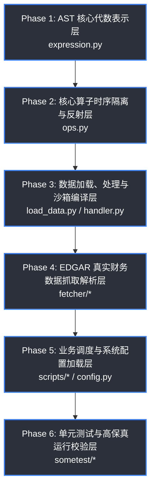

# MiniQLib 统一量化多项目工作区 (Unified Quant-Lab Workspace)

[](https://www.python.org/)
[](https://github.com/astral-sh/uv)
[](https://github.com/20070316lbw-netizen/miniqlib)
[](LICENSE)

欢迎来到 **MiniQLib** 统一量化多项目工作区！这是一个基于 **`uv workspace`** 技术构建的高性能量化开发和研究环境。

本项目完美实现了“**数据链路 + 三大主流回测与分析引擎**”的同仓管理。通过根目录的一键依赖托管，你可以在同一个 Python 虚拟环境中无冲突地调用 `Qlib`、`VectorBT` 和 `Zipline`，彻底解决了经典量化库版本冲突的“千古难题”。

---

## 🔍 核心代码审计路线图 (Core Code Audit Roadmap)

为了保证 `MiniQLib` 工作区的代码质量、架构规范及回测系统的绝对高保真（防止数据泄露与未来函数），我们设计了以下从底座到顶层的系统化审计流程：



| 阶段 | 审计目标 (Audit Target) | 核心源文件路径 (Core File Path) | 状态 | 说明 |
| :--- | :--- | :--- | :--- | :--- |
| **Phase 1** | AST 核心代数表示层 | [`mini_qlib/data/expression.py`](file:///c:/Users/liu/Desktop/miniqlib/mini_qlib/data/expression.py) | ⏳ 待审计 | 算子基类、运算符重载、零开销因子计算缓存系统 |
| **Phase 2** | 核心算子与反射防覆盖 | [`mini_qlib/data/ops.py`](file:///c:/Users/liu/Desktop/miniqlib/mini_qlib/data/ops.py) | ⏳ 待审计 | 动态参数反射、防覆盖参数锁、跨股票时序溢出隔离机制 |
| **Phase 3** | 数据加载与沙箱编译 | [`mini_qlib/data/load_data.py`](file:///c:/Users/liu/Desktop/miniqlib/mini_qlib/data/load_data.py)<br>[`mini_qlib/data/handler.py`](file:///c:/Users/liu/Desktop/miniqlib/mini_qlib/data/handler.py) | ⏳ 待审计 | 真实数据加载、因子编译沙箱化安全防线 (`eval` 限制) |
| **Phase 4** | 真实财务与价格抓取 | [`mini_qlib/fetcher/fetch_edgar.py`](file:///c:/Users/liu/Desktop/miniqlib/mini_qlib/fetcher/fetch_edgar.py)<br>[`mini_qlib/fetcher/fetch_price.py`](file:///c:/Users/liu/Desktop/miniqlib/mini_qlib/fetcher/fetch_price.py) | ⏳ 待审计 | SEC EDGAR 财务报表 XBRL 事实解析、价格批量抓取 |
| **Phase 5** | 业务调度与系统配置 | [`mini_qlib/scripts/fetch_data.py`](file:///c:/Users/liu/Desktop/miniqlib/mini_qlib/scripts/fetch_data.py)<br>[`mini_qlib/utils/config.py`](file:///c:/Users/liu/Desktop/miniqlib/mini_qlib/utils/config.py) | ⏳ 待审计 | 全局 YAML 参数配置、批量数据落库调度脚本 |
| **Phase 6** | 高保真单元与回归测试 | [`sometest/test_reflection.py`](file:///c:/Users/liu/Desktop/miniqlib/sometest/test_reflection.py)<br>[`sometest/test_phase2_computations.py`](file:///c:/Users/liu/Desktop/miniqlib/sometest/test_phase2_computations.py) | ⏳ 待审计 | 跨股票隔离与极速缓存命中率测试、NaN 阻断校验 |

> 📌 **审计交互指南**：根据 [`agent/audit_methodology.md`](file:///c:/Users/liu/Desktop/miniqlib/agent/audit_methodology.md)，用户将按模块分段出示代码，由智能体进行多维度深层安全与规范分析。

---


## 💡 开源复刻与衍生声明 (Fork & Derivative Declarations)

本工作区在本地以子项目的形式集成了以下三大顶级量化金融开源框架。虽然为了日常开发的一键提交与统一管理，我们将它们合并到了本工作区单仓中，但我们在此郑重声明并致敬以下原版项目：

| 子项目名称 (Sub-Project) | 衍生自上游原始仓库 (Derived From) | 授权协议 (License) | 说明 (Notes) |
| :--- | :--- | :--- | :--- |
| **`qlib`** | 🍴 [microsoft/qlib](https://github.com/microsoft/qlib) | MIT | 微软 AI 量化投资与机器学习平台，完美保留历史 Commit |
| **`vectorbt`** | 🍴 [polakowo/vectorbt](https://github.com/polakowo/vectorbt) | Apache-2.0 | 基于 NumPy/Numba 的超高速矢量回测与分析引擎 |
| **`zipline-reloaded`** | 🍴 [stefan-jansen/zipline-reloaded](https://github.com/stefan-jansen/zipline-reloaded) | Apache-2.0 | 支持多因子与事件驱动的回测引擎（Zipline 的现代化维护分支） |

> 💡 **小贴士**：本仓库中这三个子项目的全部代码和历史 commit 均已完美搬迁至子目录下，任何对这三个库的底层修改都会统一保存在本工作区中。

---

## 📁 项目目录结构与文件说明 (Directory Structure & Contents)

```text
miniqlib/ (工作区大根目录)
├── agent/                      # Gemini 智能助手配置、审计方法与开发规范
│   ├── config.json             # 智能助手本地核心行为指令配置
│   ├── translator.md           # 自定义翻译子代理规范 (中英双语注释与 Docstring 强制要求)
│   └── audit_methodology.md    # 块状循序渐进式代码审计方法与开发规则
├── .venv/                      # [自动生成] 由 uv workspace 编译的统一高速虚拟环境
├── .vscode/                    # VSCode 工作区特定配置
│   └── settings.json           # VSCode 工作区设置 (已完美配置 DuckDB 插件的自动挂载)
├── EXP_and_LOG/                # 每日研究实验、踩坑与解决案日志系统 (核心知识沉淀区)
│   └── 2026-05-23/
│       └── vscode_duckdb_and_ssl_issues.md # 记录 DuckDB 文件锁冲突、编码、代理 SSL 错误的解析
├── mini_qlib/                  # 本项目原生数据与研究模块 (Core Package)
│   ├── data/                   # 数据加载与处理底层操作
│   │   ├── load_data.py        # 将拉取的股票价格数据加载写入本地数据库
│   │   └── ops.py              # 底层数据防错与辅助计算操作
│   ├── database/               # 静态与数据库资产区
│   │   └── sp500_tickers.csv   # 标普500成分股列表
│   ├── fetcher/                # 高效数据抓取模块 (API 层，遵循中英双语注释规范)
│   │   ├── fetch_edgar.py      # SEC EDGAR 财务报表底层核心抓取与 XBRL 事实解析模块
│   │   ├── fetch_price.py      # 从 Yahoo Finance 批量拉取日 K 线价格数据
│   │   └── get_sp_500_list.py  # 维基百科标普500成分股名单抓取与本地缓存模块
│   ├── scripts/                # 业务调度可执行脚本区 (高层应用层)
│   │   ├── fetch_data.py       # 执行标普500价格数据抓取并存入数据库
│   │   └── fetch_edgar_runner.py # 标普500公司 SEC EDGAR 财务报表一键拉取与 DuckDB 增量入库脚本
│   └── utils/                  # 通用工具包
│       └── config.py           # 项目路径、默认数据库连接、YAML 配置文件加载器
│
# ─── 统一托管的三大顶级量化框架子项目 (UV Workspace Members) ───
├── qlib/                       # [Workspace Member] Microsoft Qlib 框架目录 (带完整历史)
├── vectorbt/                   # [Workspace Member] VectorBT 矢量回测引擎目录
├── zipline-reloaded/           # [Workspace Member] Zipline 因子回测引擎目录 (Cython 加速)
│
├── sometest/                   # 个人测试沙盒
├── config.yaml                 # 全局模型与回测配置参数文件
├── edgar.duckdb                # SEC EDGAR 真实财务大数据库文件
├── pyproject.toml              # [核心配置] 声明 uv workspace 架构和跨项目依赖关系
└── uv.lock                     # [自动生成] 锁定的工作区全量依赖树
```

---

## ⚡ 现代 Workspace 环境极速上手指南 (Modern Workspace Guide)

本工作区使用超高速 Python 包管理器 [**`uv`**](https://github.com/astral-sh/uv) 统一管理：

### 1. 一键同步并安装全部依赖 (包括三大子项目)
在工作区根目录下打开终端，直接运行：
```powershell
uv sync
```
这行命令会：
* 自动检测 `.python-version`，在本地安装 Python 3.10.x（如果不存在的话）；
* 为这三个子项目（`qlib`、`vectorbt`、`zipline`）编译它们所需的 Cython 与底层二进制依赖；
* **以 `editable` (可编辑开发) 的形式**直接将它们软链接安装到根目录的统一 `.venv` 虚拟环境中！

### 2. 启动共享的研究工作台 (Jupyter Lab)
在根目录下运行：
```powershell
uv run jupyter lab
```
在打开的 Jupyter Notebook 中，你可以直接在同一个 Kernel 里同时运行：
```python
import qlib
import vectorbt as vbt
import zipline
print("🚀 三大引擎完美共存！")
```

---

## 📝 团队开发契约与规范 (Development Conventions)

为保证项目代码的国际化水准与团队阅读体验，本项目严格遵守以下两条开发契约：

1. 🌐 **中英双语注释契约 (Bilingual Commenting)**
   所有新编写的底层方法库和高阶脚本，其内的 docstrings、模块说明、关键行代码注释**必须采用英文与中文双语对照编写**（英文在上，精确中文在下），并由 `agent/translator.md` 进行自动化规范。
2. 💾 **跨平台 UTF-8 编码契约 (UTF-8 Encoding Defense)**
   由于 Windows 环境的系统默认编码不是 UTF-8，所有涉及到文件读取和写入的操作（如 `open()`、`pd.read_csv()`、`to_csv()`、`yaml.safe_load()`），必须显式指明 `encoding="utf-8"` 参数，严禁使用系统默认编码以防止 `UnicodeDecodeError`。

---

## 📈 项目开发路线图与已完成功能 (Development Roadmap & Completed Features)

为了将 MiniQLib 打造为工业级、高性能、无未来函数的高保真多因子计算与回测系统，我们在**第一阶段（反射与参数锁）**和**第二阶段（时序隔离、参数扁平化与表达式缓存）**中实现了核心 AST 算子引擎的深度重构与规范确立：

### 🏁 第一阶段：表达式地基与动态反射 (Phase 1: Foundation & Dynamic Reflection)
- [x] **AST 地基抽离与运算符重载** ([expression.py](file:///c:/Users/liu/Desktop/miniqlib/mini_qlib/data/expression.py))：成功将底层基类 `MiniExpression` 与具体算子彻底剥离解耦，通过重载 Python 的算术与比较运算符（如 `+`, `-`, `>`, `<=`), 使得编写 `$close - $open` 即可在内存中自动链接形成高度灵活的抽象语法树。
- [x] **动态参数反射自动绑定** ([ops.py](file:///c:/Users/liu/Desktop/miniqlib/mini_qlib/data/ops.py))：基于 `__init_subclass__` 类钩子与 `inspect.signature` 反射机制，自动捕获子类实例化时的传参并动态装填绑定至实例属性，彻底省去硬编码的 `__init__` 参数赋值与公式序列化逻辑。
- [x] **继承链参数防覆盖锁** ([ops.py](file:///c:/Users/liu/Desktop/miniqlib/mini_qlib/data/ops.py))：首创 `_params_locked` 防覆盖参数锁机制，完美解决多级继承链（例如 `Rolling` -> `Mean`）中父类包装器被重复触发并恶意覆盖子类已捕获属性的架构痛点。
- [x] **双语自动因子公式编译器**：编写 `parse_field` 正则解析引擎，实现由 `"$close - Ref($open, 1)"` 外部文本因子字符串到内部 AST 树实例的自动正则转换与 `eval` 动态编译评估。
- [x] **反射与捕获单元测试** ([test_reflection.py](file:///c:/Users/liu/Desktop/miniqlib/sometest/test_reflection.py))：建立第一阶段完备的单元测试，支持参数锁、多级继承、AST 自动组装和公式解析的回归测试。

### 🚀 第二阶段：工业级计算深度优化与规范统一 (Phase 2: Industrial Optimization & Conventions)
- [x] **跨股票时序溢出绝对隔离** ([ops.py](file:///c:/Users/liu/Desktop/miniqlib/mini_qlib/data/ops.py))：在 `Rolling` 与 `Ref` 算子中统一重写 `_load_internal`。在多股票 Panel Data 场景下，自动识别 DataFrame 的 `pd.MultiIndex` 并执行 `groupby('ticker')` 时序隔离计算，彻底封堵因前一只股票的尾部历史数据溢出污染后一只股票、进而产生 Look-Ahead Bias（前瞻偏差未来函数）与回测失真的重大安全隐患。
- [x] **多参数算子 (`*args`) 扁平化捕获** ([ops.py](file:///c:/Users/liu/Desktop/miniqlib/mini_qlib/data/ops.py))：完美适配 `inspect.Parameter.VAR_POSITIONAL`（即形如 `*features` 的多参数算子），将入参在拦截定义时自动执行 `self.args.extend` 扁平化，彻底修复因嵌套 tuple 结构导致 `str()` 序列化多出双重圆括号的问题（如将 `Concat(($close,$open))` 统一修复为完美的 `Concat($close,$open)`）。
- [x] **零开销因子计算缓存系统** ([expression.py](file:///c:/Users/liu/Desktop/miniqlib/mini_qlib/data/expression.py))：引入带有 `context` 字典的递归因子缓存路由。计算链在执行 `load()` 时递归向下透传缓存，以 `str(self)` 唯一因子表达式串作为缓存键。重复算子子树仅在物理上计算一次，完美杜绝海量计算重复因子的冗余开销。
- [x] **时序隔离与极速缓存深度测试** ([test_phase2_computations.py](file:///c:/Users/liu/Desktop/miniqlib/sometest/test_phase2_computations.py))：针对时序隔离计算正确性、变长参数扁平化序列化以及缓存命中率与计算次数进行了 100% 严苛的自动化测试检验，确保在多股票维度下没有任何未来数据泄漏。
- [x] **双语高级开发规范指南** ([mini_qlib/data/README.md](file:///c:/Users/liu/Desktop/miniqlib/mini_qlib/data/README.md))：编写涵盖行情 `MultiIndex` 索引标准、大小写 Schema、PIT 财务数据机制、算子命名（特征用 `feature`，窗口用大写 `N`）以及无空格序列化格式的权威 SSOT 开发准则，确保团队所有后续代码与数据的高度一致。
- [x] **滚动算子动态有效观测窗口控制** (`min_periods` 支持) ([ops.py](file:///c:/Users/liu/Desktop/miniqlib/mini_qlib/data/ops.py))：重写时间序列基类 `Rolling` 构造器与时序加载逻辑，全面支持可选的 `min_periods` 动态观测数配置。结合独特的公式唯一序列化格式 `__str__`，在完美向下兼容微软 Qlib 行情因子的前提下，实现对不同有效观测周期因子树的严格隔离缓存与防碰撞管理。
- [x] **因子编译沙箱化安全防线** (`eval` 安全收窄) ([handler.py](file:///c:/Users/liu/Desktop/miniqlib/mini_qlib/data/handler.py))：深度加固 `DataHandler` 动态配置编译器，在 `eval()` 执行自定义公式转换时，显式传递限制的 Built-ins 名字空间 `{"__builtins__": {}}`，彻底锁死全局系统内置危险函数执行权限，构筑极致安全的因子量化沙箱环境。
- [x] **动态控制与沙箱沙盒深度测试** ([test_phase2_computations.py](file:///c:/Users/liu/Desktop/miniqlib/sometest/test_phase2_computations.py))：设计并补充 `test_min_periods_dynamic` 回归与集成测试模块，严格验证在 `min_periods > 1`（例如严格窗口 `min_periods=3`）下的时序 `NaN` 数据阻断与阻隔表现，确保全链路计算的高保真高稳定性。
